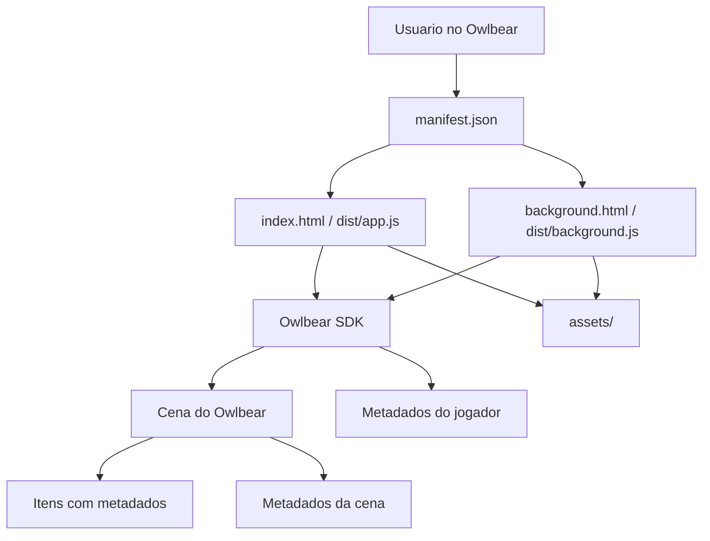

# AI Context - Cartas Duplas

Este documento e a fonte principal de contexto tecnico do projeto. Uma IA nova ou uma pessoa nova deve conseguir entender a extensao lendo este arquivo antes de alterar qualquer codigo.

## Identidade do projeto

| Campo | Valor |
| --- | --- |
| Nome publico | Cartas Duplas |
| Nome do repositorio publico | Double-Sided-Cards |
| Autor | DemonRider |
| Plataforma alvo | Owlbear Rodeo |
| Hospedagem publica | GitHub Pages |
| Manifesto publico | `https://demonrider0.github.io/Double-Sided-Cards/manifest.json?v=66` |
| Foco principal | Desktop e mobile, com prioridade pratica para jogadores em celular |

## Objetivo

A extensao simula cartas 2D de mesa dentro do Owlbear Rodeo. Ela substitui parte da experiencia de cartas do Tabletop Simulator usando imagens/tokens do proprio Owlbear, sem modelos 3D.

Ela resolve estes problemas:

- criar cartas com frente e verso;
- virar cartas individualmente;
- criar pilhas/baralhos com contagem visivel;
- comprar, embaralhar e devolver cartas;
- criar pilhas temporarias a partir de cartas sacadas;
- carregar bibliotecas publicas de pilhas e cartas;
- restaurar mapas padrao do jogo;
- selecionar jogador por cor e mover cartas de raca, classe e divindade para slots especificos.

O usuario final e o mestre/jogador que usa Owlbear Rodeo para jogar o tabuleiro preparado por DemonRider. O publico mobile e especialmente importante: funcoes essenciais nao podem depender apenas de teclado.

## Visao geral de uso

No Owlbear, a extensao aparece como um painel lateral e tambem registra comandos no tabuleiro. O fluxo esperado e:

1. O usuario instala a extensao pelo link do `manifest.json`.
2. O mestre restaura um mapa salvo, como Tutorial ou Missao 0.5.
3. Jogadores escolhem uma cor pelo identificador do tabuleiro.
4. Cartas e pilhas ja aparecem na cena ou podem ser criadas pela biblioteca publica.
5. Durante o jogo, as acoes principais sao feitas por botoes do Owlbear, menu de contexto, painel ou atalhos:
   - `V`: virar carta ou topo da pilha;
   - `C`: comprar carta da pilha;
   - `E`: embaralhar pilha;
   - `R`: devolver carta para a pilha.

## Tecnologias

| Area | Tecnologia |
| --- | --- |
| Linguagem | JavaScript ES Modules |
| UI | HTML, CSS e JavaScript puro |
| API principal | Owlbear Rodeo SDK `@owlbear-rodeo/sdk` |
| Build | Rollup, `@rollup/plugin-node-resolve`, esbuild |
| Scripts auxiliares | Node.js |
| Hospedagem | GitHub Pages |
| Persistencia | Metadados de itens/cena/jogador do Owlbear |
| Banco de dados | Nenhum |
| Backend proprio | Nenhum |

## Arquitetura resumida

A extensao e uma aplicacao frontend estatica dividida em dois pontos de entrada:

- `index.html` + `dist/app.js`: painel lateral da extensao;
- `background.html` + `dist/background.js`: processo de fundo que registra comandos e escuta eventos do Owlbear.

O codigo fonte fica em `src/`. Os arquivos em `dist/` sao gerados pelo build e fazem parte da entrega publica.

## Modulos principais

| Arquivo | Responsabilidade |
| --- | --- |
| `src/card-data.js` | Define IDs, chaves de metadados, validadores, criadores de metadata, dados de imagem/grid e logica de espelhamento do verso. |
| `src/deck.js` | Regras de pilha: detectar pilhas/cartas, atualizar exibicao, comprar, embaralhar, virar topo e devolver carta. |
| `src/flip.js` | Fluxo de virar carta ou pilha selecionada. |
| `src/selection-board.js` | Sistema de cores, identificadores de jogador, categorias de carta e slots de raca/classe/divindade. |
| `src/scene-preset.js` | Carregamento, salvamento e restauracao de mapas padrao. |
| `src/preset-decks.js` | Carregamento dos manifests de bibliotecas de pilhas. |
| `src/preset-cards.js` | Carregamento dos manifests de bibliotecas de cartas individuais. |
| `src/divinity-sizing.js` | Regras especiais de tamanho/origem das divindades. |
| `src/background.js` | Registro de comandos, atalhos, menu de contexto, listener de selecao e sincronizacao de cena. |
| `src/app.js` | UI do painel, botoes, biblioteca, migracao de assets, restauracao de mapas e acoes manuais. |
| `src/obr.js` | Bootstrap seguro do SDK do Owlbear. |
| `src/feedback.js` | Feedback visual animado na cena. |

## Como o Owlbear Rodeo e usado

A extensao usa o Owlbear SDK para:

- ler selecao atual do jogador;
- criar, atualizar e apagar itens da cena;
- registrar comandos de contexto;
- registrar acoes de ferramenta;
- registrar atalhos de teclado;
- armazenar metadados em itens, cena e jogador;
- escutar alteracoes da cena, selecao e estado dos jogadores;
- restaurar cenas completas a partir de presets JSON.

O Owlbear e a unica camada de persistencia em tempo de jogo. A extensao nao tem servidor proprio.

## Metadados

Metadados sao a fonte de verdade da extensao. A imagem visivel e apenas a representacao atual.

### Chaves principais

| Chave | Origem | Uso |
| --- | --- | --- |
| `br.demonrider.double-sided-cards/card` | Item | Marca uma imagem como carta dupla. |
| `br.demonrider.double-sided-cards/deck` | Item | Marca uma imagem como pilha/baralho. |
| `br.demonrider.double-sided-cards/color-token` | Item | Marca identificador de cor do jogador. |
| `br.demonrider.double-sided-cards/card-category` | Item | Marca carta como `race`, `class` ou `divinity`. |
| `br.demonrider.double-sided-cards/active-color` | Jogador | Guarda a cor ativa daquele jogador. |
| `br.demonrider.double-sided-cards/selection-board` | Cena | Guarda estado dos slots de raca, classe e divindade por cor. |

### Carta

Uma carta dupla deve guardar:

- nome;
- frente;
- verso;
- face atual (`front` ou `back`);
- largura no grid;
- origem quando aplicavel;
- pilha de origem quando a carta foi comprada;
- informacao de espelhamento do verso quando frente e verso representam a mesma imagem.

### Pilha

Uma pilha deve guardar:

- nome;
- verso;
- lista ordenada de cartas;
- largura no grid;
- face atual da pilha;
- camada;
- se deve ser apagada quando esvaziar;
- contagem visivel.

A ordem da lista e critica. A primeira carta da lista e o topo da pilha.

## Diferenca entre versao publica e local

O projeto teve duas formas de uso ao longo do desenvolvimento: versao publica/GitHub e versao local/localhost. As diferencas sao intencionais.

| Aspecto | Publica/GitHub | Local/localhost |
| --- | --- | --- |
| Objetivo | Jogar e restaurar mapas prontos | Preparar mapas, testar e importar assets |
| Assets | Devem vir de URLs publicas do repositorio | Podem vir de arquivos locais durante preparacao |
| Importacao manual | Deve ficar removida ou escondida quando nao for necessaria | Pode existir para preparar conteudo |
| Marcacoes administrativas | Deve evitar botoes redundantes para jogadores | Pode ter botoes de marcar cor/categoria |
| Mapas salvos | Restaurados por JSON em `assets/scene-presets/` | Podem ser criados/salvos para gerar JSON |
| Dependencia de `localhost` | Proibida | Permitida apenas em teste |

Nunca misturar estes papeis sem pedido explicito de DemonRider.

## Bibliotecas publicas

### Pilhas

As pilhas de biblioteca ficam em `assets/preset-decks/` e sao backups infinitos. Criar uma pilha da biblioteca nao consome a biblioteca.

Pilhas conhecidas:

- Ameacas Elite;
- Armas;
- Salas;
- Salas-Refugiados;
- Salas-Objetivos;
- Salas-Normais;
- Poderes da Tormenta Nivel 1;
- Poderes da Tormenta Nivel 2;
- Poderes da Tormenta Nivel 3;
- Eventos.

### Cartas individuais

As cartas individuais ficam em `assets/preset-cards/` e tambem sao backups infinitos.

Grupos conhecidos:

- Classes;
- Racas;
- Divindades;
- Reacoes Heroicas;
- Herois;
- Herois Montaria.

Classes, racas e divindades podem nascer marcadas com categoria para interagir com slots de jogador.

## Mapas salvos

Mapas salvos ficam em `assets/scene-presets/`.

Mapas atuais:

- `tutorial.json`;
- `missao-0-5.json`.

Na versao publica, a restauracao deve reconstruir a cena sem exigir que usuarios finais importem imagens ou criem backups.

## Decisoes tecnicas que nunca devem ser quebradas

1. Metadados sao a fonte de verdade.
2. A extensao publica nao pode depender de `localhost`, caminhos absolutos do Windows ou arquivos locais.
3. Mobile e prioridade.
4. Atalhos e comandos do Owlbear devem continuar funcionando.
5. `V`, `C`, `E` e `R` devem preservar seus comportamentos.
6. Cartas compradas respeitam a face atual da pilha.
7. Devolver carta vai para o fundo da pilha.
8. Pilhas temporarias podem se apagar quando vazias.
9. Nao reintroduzir compra por arrasto nem devolucao por arrasto sem pedido explicito.
10. Nao permitir que cartas em slots de outra cor sejam apropriadas por outro jogador.
11. Cartas de raca e classe em slot ficam bloqueadas; divindades nao.
12. `Devolver origem` deve permanecer acessivel em `Acoes`.
13. Divindades devem preservar tamanho e origem especiais.
14. Build e cache busting devem ser atualizados quando codigo/HTML/CSS/manifest mudarem.
15. Autoria deve permanecer DemonRider.

## Restricoes tecnicas

- O Owlbear SDK nao oferece transacao completa entre atualizar pilha, criar carta e apagar carta solta.
- Operacoes multiplayer podem sofrer corrida se dois jogadores acionarem a mesma pilha ao mesmo tempo.
- Cenas grandes e assets pesados impactam mobile.
- GitHub Pages e estatico: nao grava arquivos novos em runtime.
- O painel e o background rodam em contextos separados e se comunicam por SDK/broadcast.

## Compatibilidade

Alteracoes futuras devem considerar:

- cenas antigas com metadados incompletos;
- cartas ja criadas em mesas reais;
- mapas salvos versionados em JSON;
- jogadores mobile sem teclado;
- cache agressivo do navegador e do GitHub Pages;
- diferencas entre extensao local e publica.

## Ordem de leitura para manutencao

Antes de trabalhar no projeto, uma IA ou pessoa desenvolvedora deve ler:

1. `docs/CONTRIBUTING_AI.md`, como guia operacional.
2. Este arquivo, como contexto principal.
3. `PROJECT_RULES.md`, como regras permanentes.
4. `docs/ARCHITECTURE.md`, para entender fluxo e modulos.
5. `docs/DESIGN_DECISIONS.md`, para preservar decisoes historicas.
6. `docs/AUDIT_HISTORY.md`, `docs/IMPLEMENTATION_PLAN.md` e `docs/TEST_CHECKLIST.md`, quando a tarefa envolver correcao, risco ou validacao.

## Comportamento esperado de uma IA neste projeto

Antes de alterar o codigo, uma IA deve:

1. Ler `docs/CONTRIBUTING_AI.md`.
2. Ler este arquivo.
3. Ler `PROJECT_RULES.md`.
4. Conferir `manifest.json`, `package.json` e arquivos relevantes em `src/`.
5. Entender se o pedido e para versao publica, local ou ambas.
6. Evitar tocar em assets e mapas salvos sem necessidade.
7. Nao remover metadados ou compatibilidade historica sem justificativa.
8. Nao reintroduzir funcionalidades descontinuadas.
9. Rodar `npm run build` quando alterar `src`.
10. Atualizar cache/versionamento quando necessario.
11. Registrar mudancas em `docs/CHANGELOG_AI.md`.

Se houver duvida entre uma solucao simples e uma que arrisca quebrar mapas ou partidas, escolher a solucao mais conservadora.
