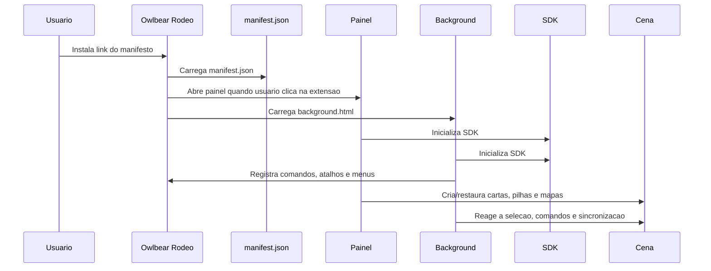
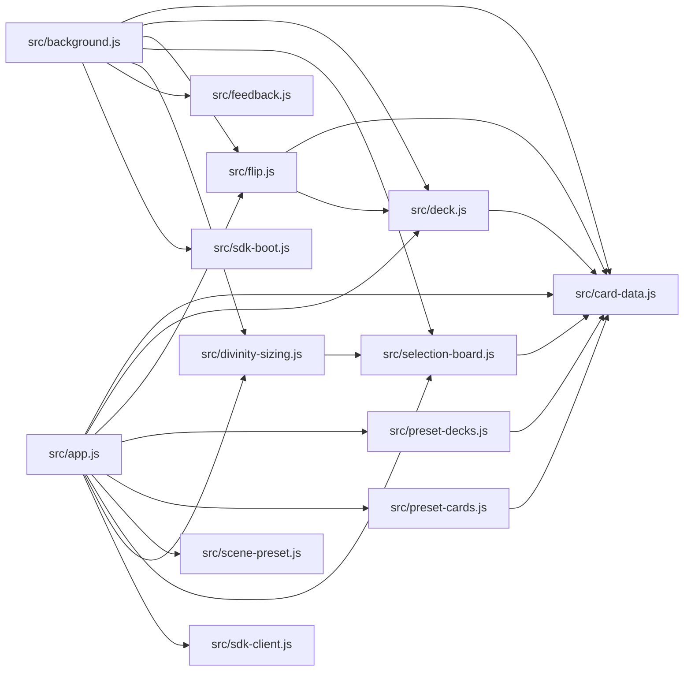
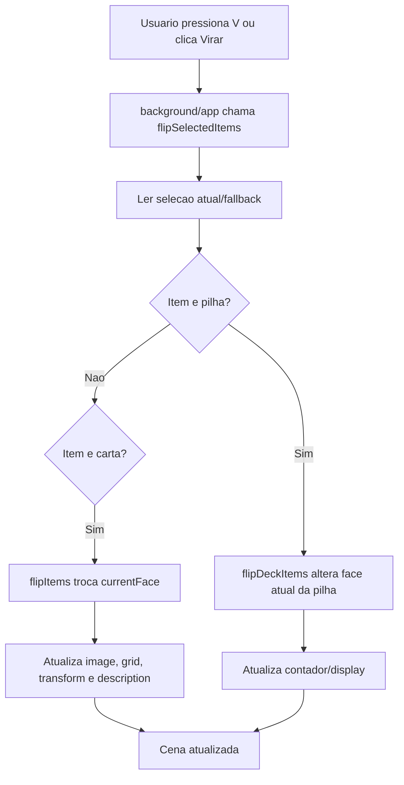
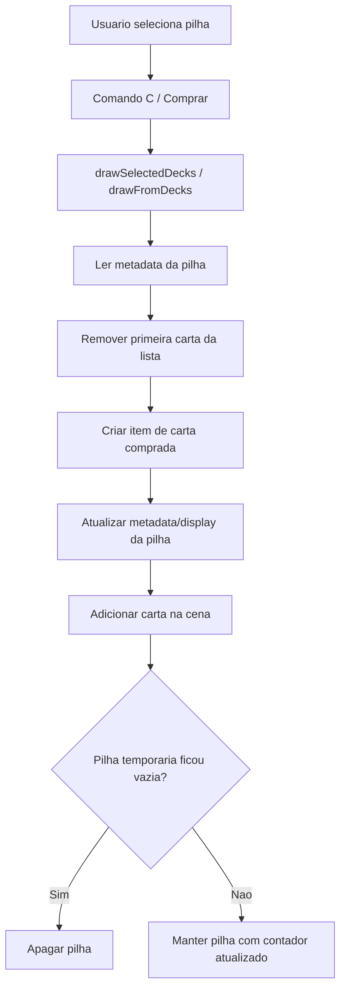
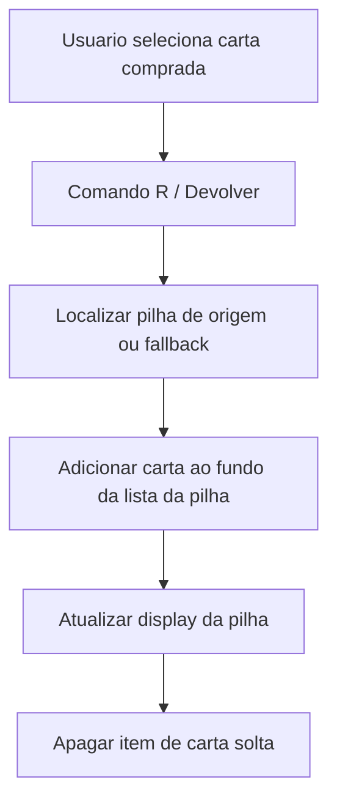
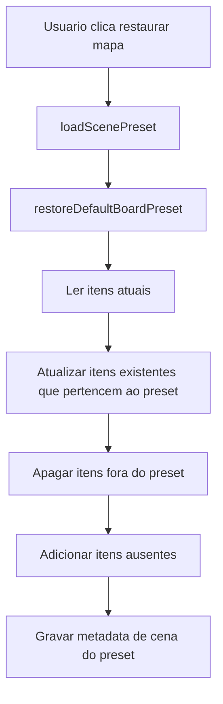
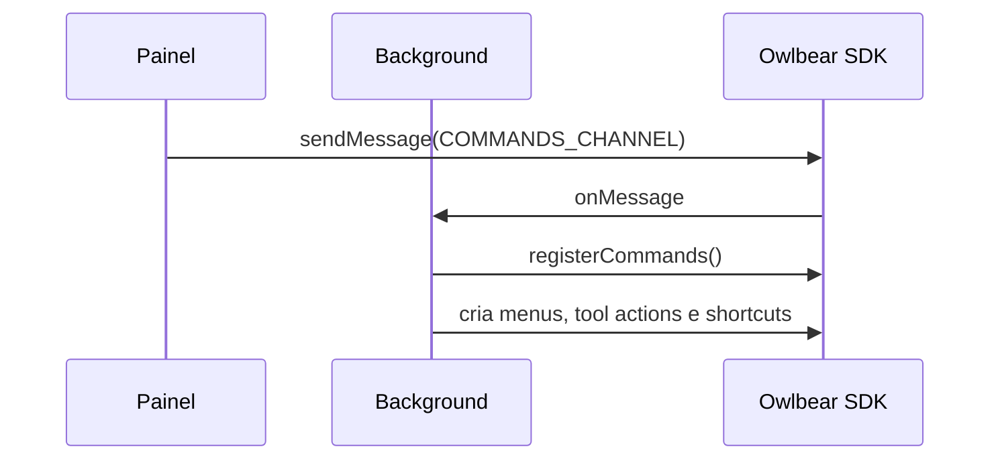
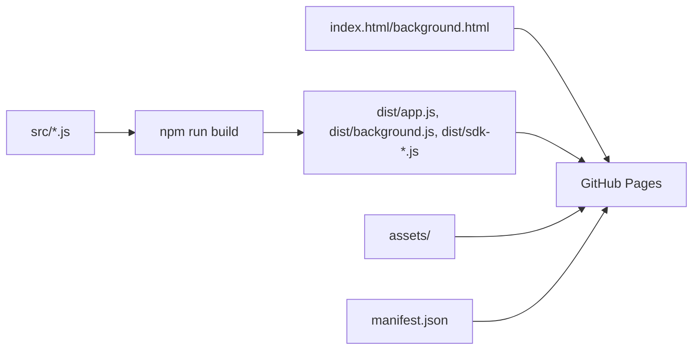

# Architecture - Cartas Duplas

Este documento descreve a arquitetura tecnica da extensao Cartas Duplas.

## Estrutura de pastas

```text
.
|-- assets/
|   |-- local-assets/
|   |-- preset-cards/
|   |-- preset-decks/
|   `-- scene-presets/
|-- dist/
|-- docs/
|-- icons/
|-- node_modules/
|-- scripts/
|-- src/
|-- vendor/
|-- background.html
|-- build.mjs
|-- dev-server.mjs
|-- index.html
|-- manifest.json
|-- package.json
|-- PROJECT_RULES.md
`-- README.md
```

## Responsabilidades por pasta

| Pasta | Responsabilidade | Observacoes |
| --- | --- | --- |
| `assets/local-assets/` | Imagens publicadas que vieram de importacoes locais ou mapas salvos. | Pode ficar grande; nao deve conter caminhos locais no uso publico. |
| `assets/preset-decks/` | Bibliotecas publicas de pilhas. | Inclui imagens e `decks.json` gerado por script. |
| `assets/preset-cards/` | Bibliotecas publicas de cartas individuais. | Inclui imagens e `cards.json` gerado por script. |
| `assets/scene-presets/` | Presets de mapas restauraveis. | Contem JSON completo dos mapas. |
| `dist/` | Bundles gerados pelo build. | Entregue ao GitHub Pages. Nao editar manualmente. |
| `docs/` | Documentacao permanente do projeto. | Fonte de contexto tecnico. |
| `icons/` | Icones usados pelo manifesto e comandos. | Referenciados por manifesto/background. |
| `scripts/` | Scripts de preparacao de assets e manifests. | Executados via `npm run ...`. |
| `src/` | Codigo fonte da extensao. | Principal area de manutencao. |
| `vendor/` | Dependencias vendorizadas, se houver. | Mantida para compatibilidade. |

## Pontos de entrada

| Arquivo | Papel |
| --- | --- |
| `manifest.json` | Declara a extensao para o Owlbear Rodeo. |
| `index.html` | UI do painel lateral. Carrega `dist/app.js`. |
| `background.html` | Contexto de fundo. Carrega `dist/background.js`. |
| `src/app.js` | Fonte do painel. |
| `src/background.js` | Fonte do processo de fundo. |

## Ciclo de vida da extensao



## Dependencias entre modulos



## Fluxo geral das chamadas

### Virar carta ou pilha



### Comprar carta da pilha



### Devolver carta



### Restaurar mapa salvo



## Persistencia dos metadados

A extensao nao usa banco externo. O estado de jogo fica distribuido assim:

| Estado | Local |
| --- | --- |
| Frente/verso/face de carta | Metadata do item da carta |
| Lista de cartas da pilha | Metadata do item da pilha |
| Contagem visual da pilha | Texto do item da pilha |
| Cor ativa do jogador | Metadata do jogador |
| Ocupacao dos slots | Metadata da cena |
| Mapas salvos publicos | JSON em `assets/scene-presets/` |
| Bibliotecas de pilhas/cartas | JSON e imagens em `assets/preset-*` |

## Integracao com o SDK do Owlbear

### Painel

O painel usa o SDK para:

- buscar selecao;
- adicionar cartas/pilhas;
- restaurar presets;
- enviar mensagens para o background;
- executar acoes por botoes;
- mostrar estado de conexao;
- listar jogadores e cores.

### Background

O background usa o SDK para:

- criar comandos de contexto;
- criar acoes na barra de ferramentas;
- registrar atalhos;
- reagir a mudancas de selecao;
- sincronizar displays de pilhas;
- reparar URLs de assets quando necessario;
- aplicar selecao automatica de cor/categoria.

## Comunicacao painel-background

O canal `br.demonrider.double-sided-cards/commands` e usado para solicitar registro de comandos pelo background. O painel tambem consegue executar acoes diretamente quando necessario.



## Estrutura dos assets

### Preset decks

Cada pilha de biblioteca tem:

- pasta de imagens;
- imagem de verso, normalmente `Verso.png`;
- manifest `decks.json`;
- tamanho padrao e camada padrao.

O script `scripts/build-preset-decks.mjs` gera/atualiza o manifest.

### Preset cards

Cada grupo de cartas tem:

- pasta de imagens;
- verso de grupo `Verso.png` ou verso individual como `Nome verso.png`;
- manifest `cards.json`;
- categoria opcional (`race`, `class`, `divinity`);
- tamanho, camada e origem opcionais.

O script `scripts/build-preset-cards.mjs` gera/atualiza o manifest.

## Build



Comandos principais:

| Comando | Funcao |
| --- | --- |
| `npm run build` | Gera bundles em `dist/`. |
| `npm run build:preset-decks` | Atualiza manifests de pilhas e cartas, depois deve rodar build. |
| `npm run build:preset-cards` | Atualiza apenas manifest de cartas. |
| `npm run prepare:github-assets` | Prepara assets locais para publicacao. |
| `node dev-server.mjs 5180` | Servidor local de teste. |

## Ordem de leitura recomendada

Para manutencao futura, a ordem recomendada da documentacao e:

1. `docs/CONTRIBUTING_AI.md`
2. `docs/AI_CONTEXT.md`
3. `PROJECT_RULES.md`
4. `docs/ARCHITECTURE.md`
5. `docs/DESIGN_DECISIONS.md`
6. `docs/AUDIT_HISTORY.md`
7. `docs/IMPLEMENTATION_PLAN.md`
8. `docs/TEST_CHECKLIST.md`
9. `docs/CHANGELOG_AI.md`

## Areas de alto risco

| Area | Risco |
| --- | --- |
| `src/deck.js` | Pode duplicar, perder ou corromper cartas/pilhas. |
| `src/scene-preset.js` | Pode apagar/recriar muitos itens da cena. |
| `src/selection-board.js` | Pode quebrar controle de cor e slots de jogador. |
| `src/background.js` | Pode remover comandos, atalhos ou gerar lentidao. |
| `assets/scene-presets/` | Qualquer erro afeta restauracao publica dos mapas. |

## Regra de ouro

Antes de mudar qualquer fluxo, lembrar que a cena do Owlbear e compartilhada em multiplayer. Uma operacao que parece correta para um usuario pode falhar quando dois usuarios agem ao mesmo tempo.
