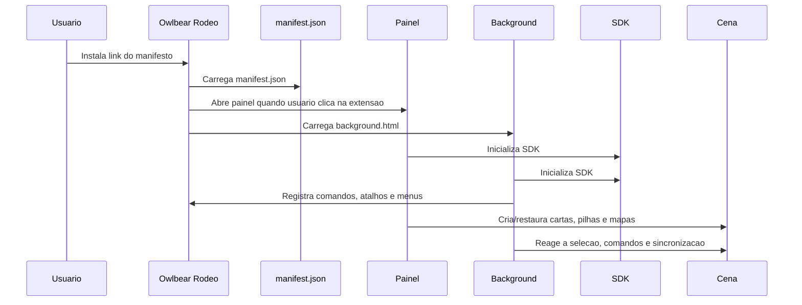
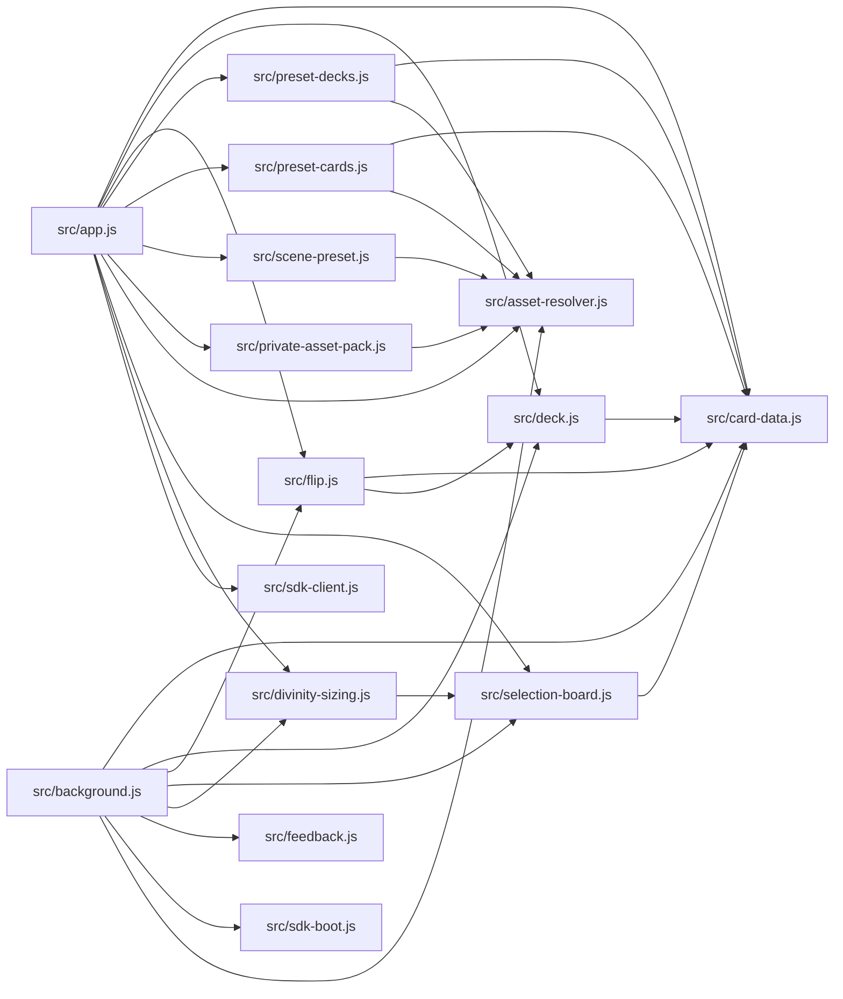
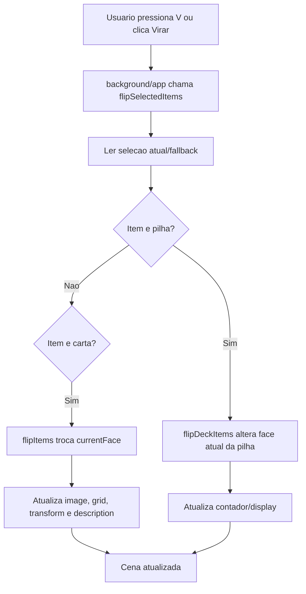
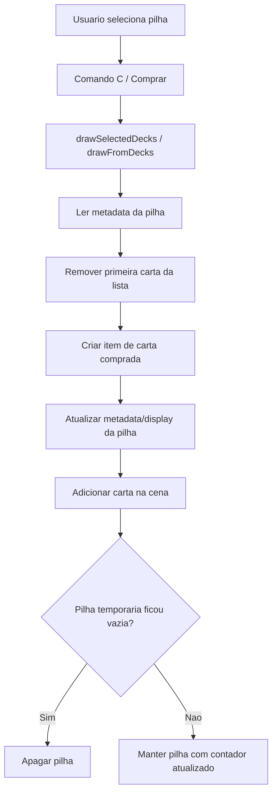
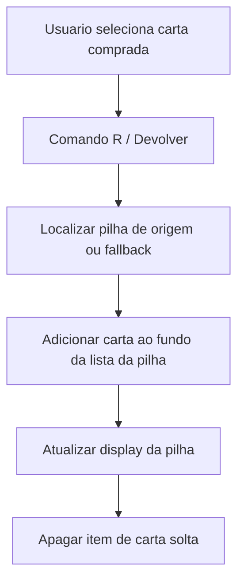
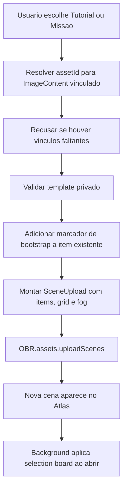
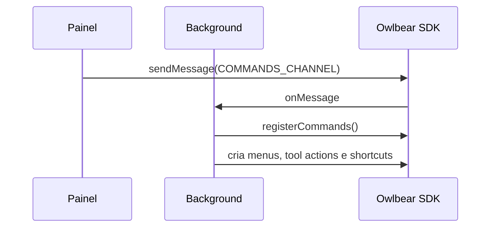
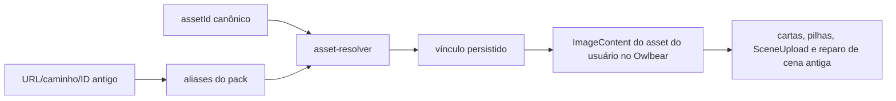
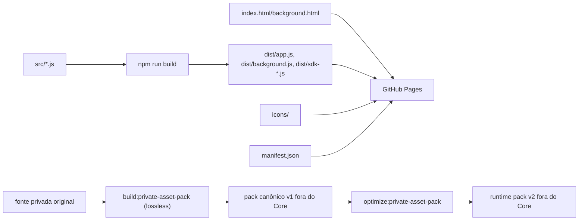

# Arquitetura — Cartas Duplas

Este documento descreve a arquitetura técnica da extensão Cartas Duplas.

## Estrutura de pastas

```text
.
|-- dist/
|-- docs/
|-- icons/
|-- scripts/
|-- src/
|-- vendor/
|-- background.html
|-- build.mjs
|-- CHANGELOG.md
|-- DEVELOPMENT.md
|-- dev-server.mjs
|-- index.html
|-- manifest.json
|-- package.json
|-- PROJECT_RULES.md
`-- README.md
```

## Responsabilidades por pasta

| Pasta | Responsabilidade | Observacoes |
| --- | --- | --- |
| `dist/` | Bundles gerados pelo build. | Entregue ao GitHub Pages. Nao editar manualmente. |
| `docs/` | Documentacao permanente do projeto. | Fonte de contexto tecnico. |
| `icons/` | Icones usados pelo manifesto e comandos. | Referenciados por manifesto/background. |
| `scripts/` | Build, verificacao do Core e ferramentas opcionais do pack privado. | O pack gerado deve ficar fora do Core. |
| `src/` | Codigo fonte da extensao. | Principal area de manutencao. |
| `vendor/` | Dependencias vendorizadas, se houver. | Mantida para compatibilidade. |

## Pontos de entrada

| Arquivo | Papel |
| --- | --- |
| `manifest.json` | Declara a extensao para o Owlbear Rodeo. |
| `index.html` | UI do painel lateral. Carrega `dist/app.js`. |
| `background.html` | Contexto de fundo. Carrega `dist/background.js`. |
| `src/app.js` | Fonte do painel. |
| `src/background.js` | Fonte do processo de fundo. |

## Ciclo de vida da extensao



## Dependencias entre modulos



## Fluxo geral das chamadas

### Virar carta ou pilha



### Comprar carta da pilha



### Devolver carta



Para tornar retries e repeticoes locais idempotentes, a entrada recolocada na
pilha guarda `returnedSceneItemId`, com o `id` da instancia de item removida da
cena. Antes de acrescentar a entrada, a devolucao verifica esse marcador na
pilha relida pelo `updateItems`; uma repeticao observada no estado relido apenas
conclui a exclusao da carta solta. O marcador fica na propria entrada, e e
substituido pelo novo `item.id` quando aquela carta for sacada e devolvida outra
vez. Cartas antigas sem o campo continuam validas e recebem o marcador somente
na primeira devolucao; campos desconhecidos da carta e da pilha continuam
preservados.

Essa idempotencia nao elimina completamente uma corrida distribuida rara: dois
clientes podem ler a pilha antes de qualquer um observar o marcador do outro e
acrescentar a mesma instancia. O SDK nao oferece transacao distribuida ou
compare-and-swap para fechar essa janela.

### Criar cena privada



O upload não lê, apaga ou atualiza itens da cena aberta. IDs de itens do template
são preservados porque `SceneUpload.items` aceita `Item[]`; assim `attachedTo` e
referências internas permanecem consistentes sem remapeamento especulativo. Como
`SceneUpload` não possui metadata arbitrária de cena, somente o selection board
é transportado por um marcador idempotente em um item existente. Metadata de
outras extensões não é propagada como metadata da nova cena.

## Persistencia dos metadados

A extensao nao usa banco externo. O estado de jogo fica distribuido assim:

| Estado | Local |
| --- | --- |
| Frente/verso/face de carta | Metadata do item da carta |
| Lista de cartas da pilha | Metadata do item da pilha |
| Contagem visual da pilha | Texto do item da pilha |
| Cor ativa do jogador | Metadata do jogador |
| Ocupacao dos slots | Metadata da cena |
| Bootstrap temporário de cena privada | Metadata interna versionada de um item existente |
| Configuracao do Private Asset Pack | `localStorage` da origem da extensao |
| Vinculos `assetId -> ImageContent` | `localStorage` da origem da extensao |
| Mapas e bibliotecas pessoais | JSON no pack privado, carregado no armazenamento local |
| Binarios privados | Biblioteca de assets pertencente ao usuario no Owlbear |

## Integracao com o SDK do Owlbear

### Painel

O painel usa o SDK para:

- buscar selecao;
- adicionar cartas/pilhas;
- restaurar presets;
- enviar mensagens para o background;
- executar acoes por botoes;
- mostrar estado de conexao;
- listar jogadores e cores.
- enviar arquivos canônicos com `OBR.assets.uploadImages`;
- selecionar e vincular assets do usuario com `OBR.assets.downloadImages`.

### Background

O background usa o SDK para:

- criar comandos de contexto;
- criar acoes na barra de ferramentas;
- registrar atalhos;
- reagir a mudancas de selecao;
- sincronizar displays de pilhas;
- reparar aliases e URLs historicas por meio do resolvedor central;
- aplicar selecao automatica de cor/categoria.

## Comunicacao painel-background

O canal `br.demonrider.double-sided-cards/commands` e usado para solicitar registro de comandos pelo background. O painel tambem consegue executar acoes diretamente quando necessario.



## Resolucao central e Private Asset Pack

`src/asset-resolver.js` e a unica camada que converte uma referencia logica ou historica em imagem utilizavel. Os consumidores recebem `assetId` canonico; caminhos antigos sao apenas entradas de compatibilidade.



O normalizador reconhece URLs completas do GitHub Pages, caminhos relativos antigos, variantes `localhost/.local-assets`, URLs aninhadas que o reparo historico ja tratava e IDs antigos de `images.owlbear.rodeo`. O alias aponta para um unico ID `sha256:<hash>`, permitindo remover copias fisicas sem apagar identificadores antigos.

O pack privado usa:

```text
private-asset-pack.json       # assets logicos, blobSha256, aliases e indice de presets
assets/<assetId>.<extensao>   # representacao runtime PNG/WebP/JPEG
presets/cards.json            # biblioteca privada de cartas por assetId
presets/decks.json            # biblioteca privada de pilhas por assetId
presets/scenes/*.json         # mapas privados por assetId
```

Ao selecionar a pasta, o painel hidrata os JSONs e persiste apenas dados e vinculos; binarios nunca entram no `localStorage`. `uploadImages` envia os arquivos, mas no SDK 3.1.0 retorna `void`. O usuario precisa entao selecionar os assets em `downloadImages`; o nome/descricao gerados carregam o ID canonico e permitem montar o vinculo persistente.

Sem pack, os loaders retornam listas vazias e os botoes de presets permanecem desabilitados. O restante da extensao nao depende desse estado opcional.

## Build



Comandos principais:

| Comando | Funcao |
| --- | --- |
| `npm run build` | Gera bundles em `dist/`. |
| `npm run build:private-asset-pack -- --source <origem> --output <dir>` | Migra uma arvore privada historica para um pack canonico fora do Core, sem recompressao. |
| `npm run optimize:private-asset-pack -- --source-pack <dir> --output <runtime>` | Gera o runtime v2 sem alterar a fonte; `assetId` é lógico e `blobSha256` valida os bytes. |
| `npm run check:private-asset-pack -- --pack <dir>` | Verifica hashes, aliases e presets privados. |
| `npm run test:regressions` | Testa resolvedor, aliases, ausencia de pack e regressao de pilhas. |
| `node dev-server.mjs 5180` | Servidor local de teste. |

## Ordem de leitura recomendada

Para manutenção futura, a ordem recomendada da documentação é:

1. `PROJECT_RULES.md`
2. `DEVELOPMENT.md`
3. `docs/ARCHITECTURE.md`
4. `docs/DESIGN_DECISIONS.md`
5. `docs/AUDIT_HISTORY.md`, quando a tarefa envolver histórico técnico ou riscos já revisados;
6. `docs/IMPLEMENTATION_PLAN.md`, como registro histórico do plano S-01 a S-20;
7. `docs/TEST_CHECKLIST.md`, para validações manuais e regressão;
8. `CHANGELOG.md`, para a cronologia das mudanças.

## Areas de alto risco

| Area | Risco |
| --- | --- |
| `src/deck.js` | Pode duplicar, perder ou corromper cartas/pilhas. |
| `src/scene-preset.js` | Pode apagar/recriar muitos itens da cena. |
| `src/selection-board.js` | Pode quebrar controle de cor e slots de jogador. |
| `src/background.js` | Pode remover comandos, atalhos ou gerar lentidao. |
| `src/asset-resolver.js` | Pode quebrar aliases e referencias persistidas antigas. |
| `src/private-asset-pack.js` | Pode vincular o asset errado ou deixar bibliotecas incompletas. |
| Private Asset Pack | Qualquer erro afeta bibliotecas e restauracao dos mapas privados. |

## Regra de ouro

Antes de mudar qualquer fluxo, lembrar que a cena do Owlbear e compartilhada em multiplayer. Uma operacao que parece correta para um usuario pode falhar quando dois usuarios agem ao mesmo tempo.
